# 系统架构图模板

使用此模板快速创建系统架构设计文档。

---

## 基础三层架构模板

### 使用场景
传统的三层架构系统（表现层、业务逻辑层、数据层）。

### 架构图

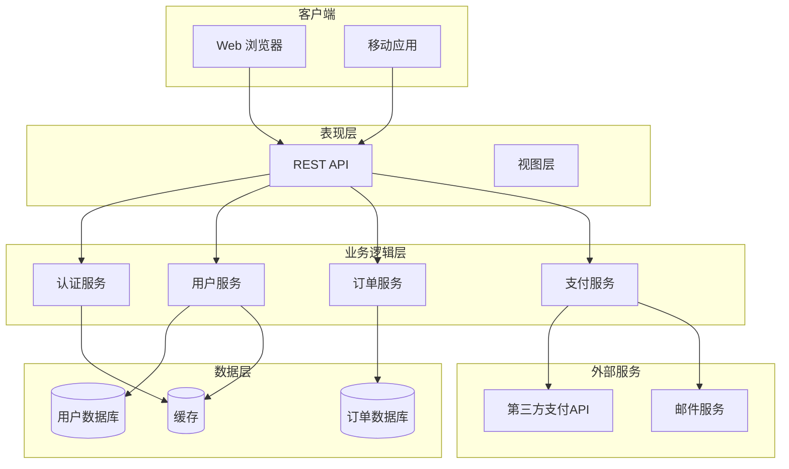

### 层级说明

- **客户端**: 使用系统的应用程序
- **表现层**: 提供 API 和用户界面
- **业务逻辑层**: 核心业务处理
- **数据层**: 数据存储和缓存
- **外部服务**: 第三方集成

---

## 微服务架构模板

### 使用场景
使用微服务架构的分布式系统。

### 架构图

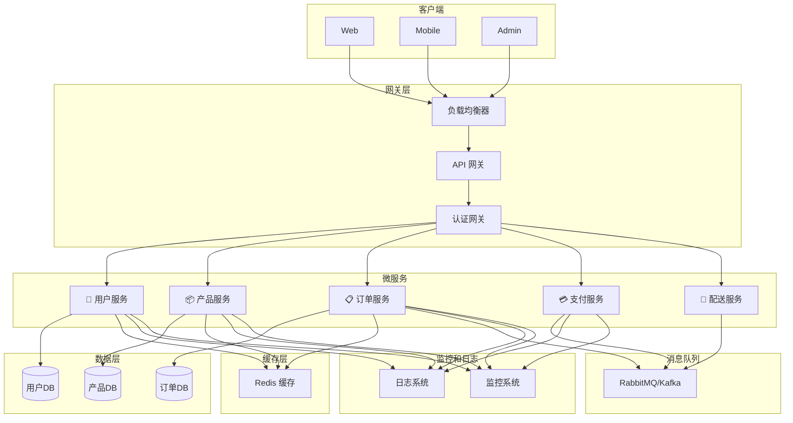

### 组件说明

- **网关层**: 请求路由和负载均衡
- **微服务**: 独立的业务服务
- **缓存层**: 提高性能
- **数据层**: 分散的数据存储
- **消息队列**: 服务间异步通信
- **监控**: 系统可观测性

---

## 高可用架构模板

### 使用场景
支持高可用、容灾备份的企业级系统。

### 架构图

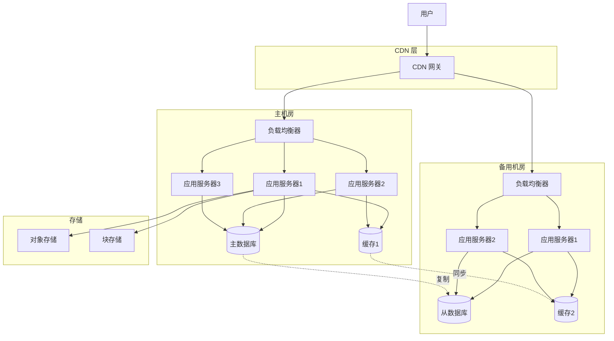

### 特点

- **多区域部署**: 主备机房架构
- **负载均衡**: 流量分散
- **数据复制**: 主从同步
- **缓存同步**: 保证数据一致性
- **CDN**: 加速静态内容

---

## 云原生架构模板

### 使用场景
使用 Kubernetes 等容器编排的云原生应用。

### 架构图

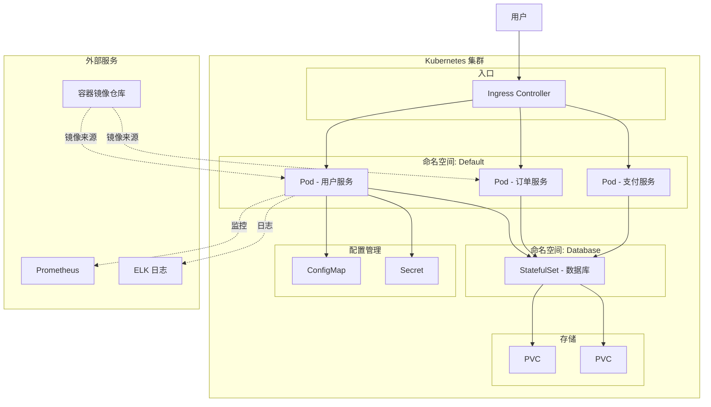

---

## 创建自己的架构图

### 步骤 1: 确定层级

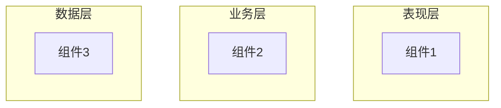

### 步骤 2: 添加具体组件

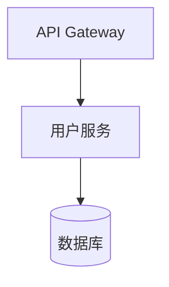

### 步骤 3: 添加外部服务

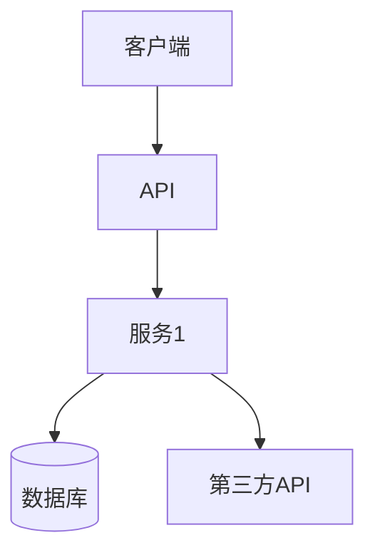

### 步骤 4: 添加 subgraph 分组

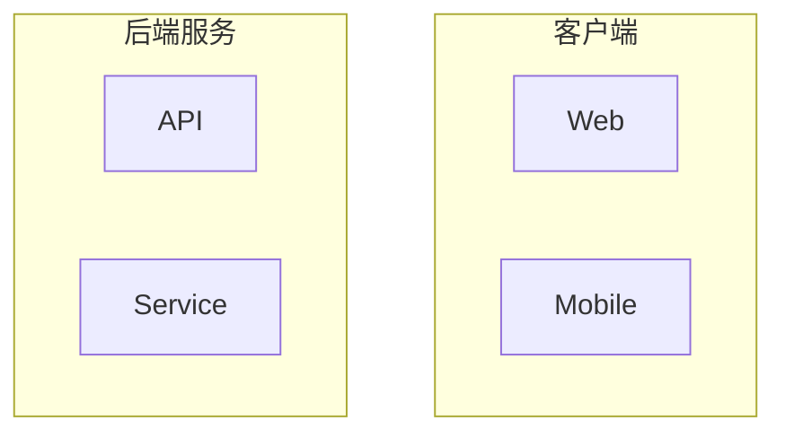

---

## 最佳实践

### ✅ 推荐做法

- 使用清晰的层级划分
- 组件使用有意义的名称
- 标注数据流向
- 使用 subgraph 进行逻辑分组
- 包含所有关键组件
- 添加文字说明

### ❌ 避免

- 过于复杂，单个图表包含过多内容
- 模糊的组件名称
- 遗漏关键组件
- 不清楚的数据流
- 混乱的连接线

---

## 导出和使用

### 在 GitHub 中

直接保存此文件，GitHub 会自动渲染架构图。

### 导出为图片

```bash
mmdc -i architecture.md -o architecture.png
```

### 在演示中使用

```bash
# 导出为 SVG 便于缩放
mmdc -i architecture.md -o architecture.svg
```

---

## 高级技巧

### 1. 添加图例

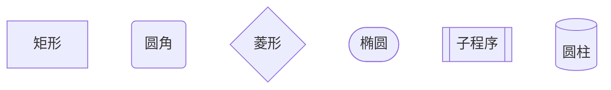

### 2. 连接线样式

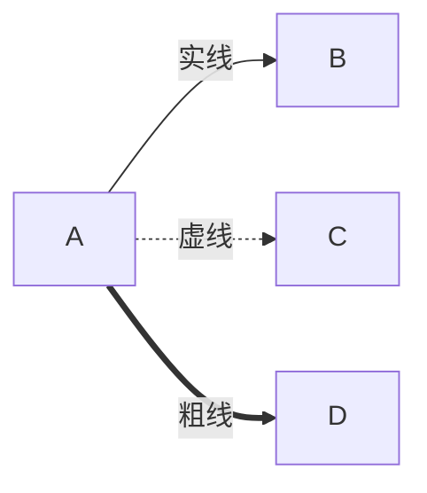

### 3. 添加注释

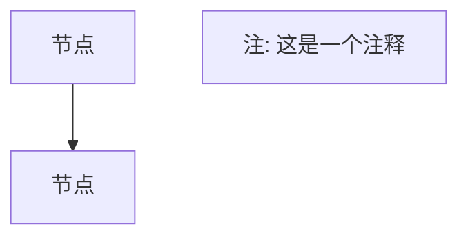

---

## 相关文档

- [Diagram Drawing Ability](../abilities/diagram-drawing.md)
- [Mermaid 图表示例](../examples/mermaid-examples.md)
- [最佳实践指南](../abilities/diagram-drawing.md#最佳实践)

---

## 下一步

1. 复制此模板并修改为您的系统
2. 在项目文档中使用
3. 与团队分享和讨论
4. 定期更新以反映系统最新设计
