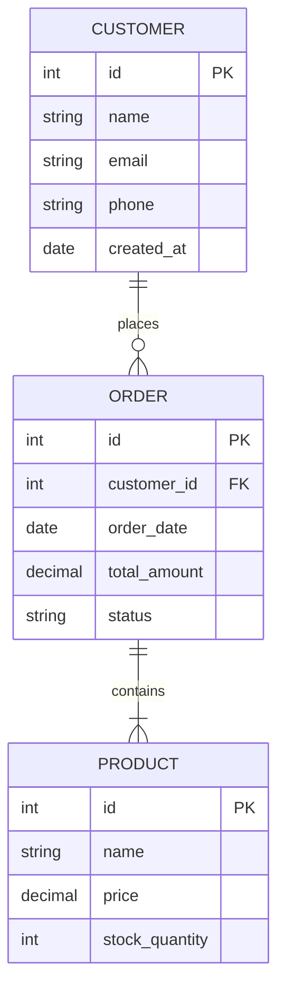
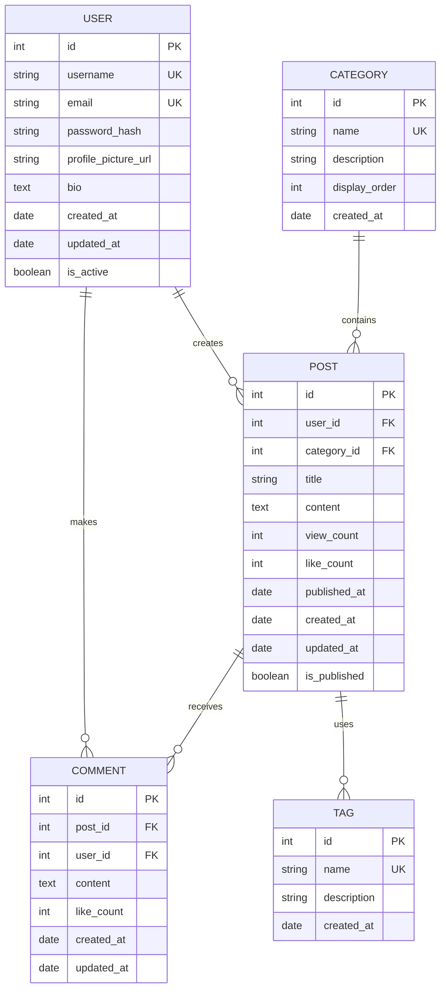
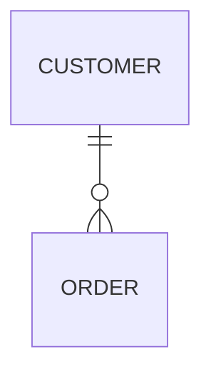
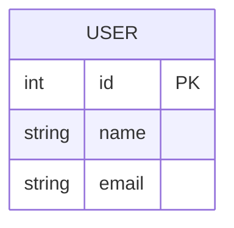
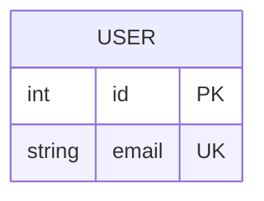
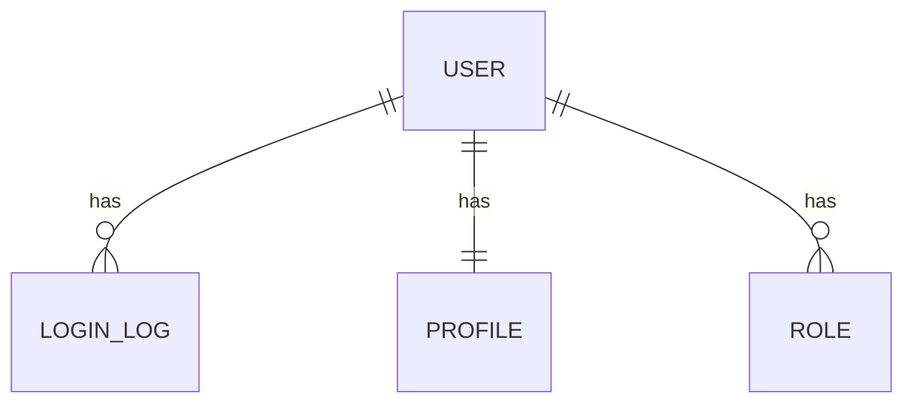
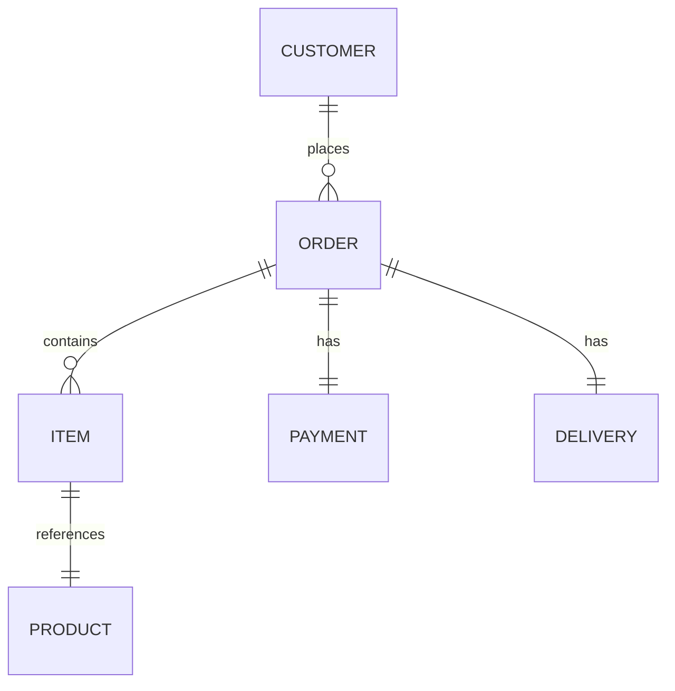
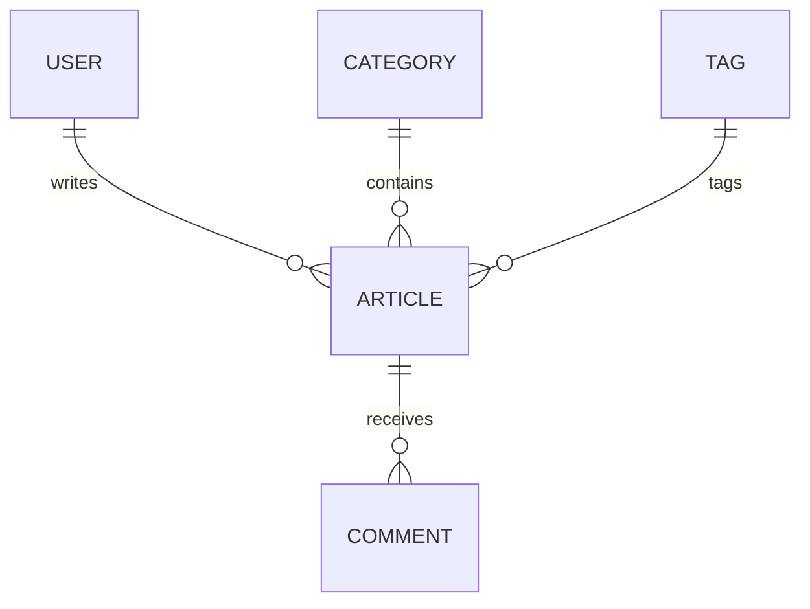

# ER 图（实体关系图）模板

使用此模板快速创建数据库设计文档。

---

## 基础 ER 图模板

### 使用场景
在这里描述数据库的应用场景。

### ER 图



### 关键概念

- **PK**: 主键 (Primary Key)
- **FK**: 外键 (Foreign Key)
- **||**: 一对一关系
- **||--o{**: 一对多关系
- **o{**: 零个或多个

---

## 复杂 ER 图模板

### 使用场景
适用于电商、社交等复杂数据库系统。

### ER 图



### 表说明

1. **USER 用户表**
   - 存储用户基本信息
   - username 和 email 唯一

2. **POST 文章表**
   - 关联用户和分类
   - 记录发布状态和统计数据

3. **COMMENT 评论表**
   - 关联文章和用户
   - 支持评论统计

4. **TAG 标签表**
   - 独立的标签管理
   - 支持多个标签关联

5. **CATEGORY 分类表**
   - 文章分类管理
   - 支持显示顺序

---

## 关系类型说明

### 一对多关系 (One-to-Many)

- 一个顾客可以有多个订单
- 每个订单属于一个顾客

### 多对多关系 (Many-to-Many)

- 一个学生可以选多个课程
- 一个课程可以有多个学生

### 一对一关系 (One-to-One)

- 一个用户有一个个人资料
- 一个个人资料属于一个用户

---

## 数据类型

### 常用数据类型

| 类型 | 描述 | 示例 |
|------|------|------|
| `int` | 整数 | ID, 数量 |
| `bigint` | 大整数 | 大 ID |
| `string` | 字符串 | 名称, 邮箱 |
| `text` | 长文本 | 描述, 内容 |
| `decimal` | 十进制数 | 价格, 金额 |
| `date` | 日期 | 创建日期 |
| `datetime` | 日期时间 | 更新时间 |
| `boolean` | 布尔值 | 是否激活 |

### 键类型

| 标记 | 含义 | 用法 |
|------|------|------|
| `PK` | 主键 | 唯一标识记录 |
| `FK` | 外键 | 关联其他表 |
| `UK` | 唯一键 | 确保值唯一 |

---

## 创建步骤

### 1. 识别实体

列出系统中的主要实体：
- 用户
- 订单
- 产品
- 支付
- 配送

### 2. 定义属性

为每个实体定义属性：


### 3. 建立关系

定义实体之间的关系：


### 4. 添加约束

标记主键、外键、唯一键：


---

## 最佳实践

### ✅ 推荐做法

- 使用英文表名和字段名
- 每个表都有主键
- 使用有意义的字段名
- 添加时间戳字段 (created_at, updated_at)
- 明确标注外键关系
- 为相关字段添加适当的约束

### ❌ 避免

- 过于复杂的关系
- 含糊的字段名
- 没有主键的表
- 过多的冗余字段
- 循环依赖

---

## 规范化建议

### 第一范式 (1NF)
- 所有字段都是原子值
- 避免重复的字段组

### 第二范式 (2NF)
- 符合第一范式
- 非键属性完全函数依赖于主键

### 第三范式 (3NF)
- 符合第二范式
- 非键属性不依赖于其他非键属性

---

## 导出和使用

### 在 GitHub 中

直接保存此文件，GitHub 会自动渲染 ER 图。

### 导出为图片

```bash
mmdc -i er-diagram.md -o er-diagram.png
```

### 在数据库工具中使用

导出 SQL 脚本创建表：

```sql
CREATE TABLE user (
    id INT PRIMARY KEY AUTO_INCREMENT,
    username VARCHAR(50) UNIQUE NOT NULL,
    email VARCHAR(100) UNIQUE NOT NULL,
    password_hash VARCHAR(255) NOT NULL,
    created_at TIMESTAMP DEFAULT CURRENT_TIMESTAMP
);

CREATE TABLE post (
    id INT PRIMARY KEY AUTO_INCREMENT,
    user_id INT NOT NULL,
    title VARCHAR(200) NOT NULL,
    content LONGTEXT NOT NULL,
    created_at TIMESTAMP DEFAULT CURRENT_TIMESTAMP,
    FOREIGN KEY (user_id) REFERENCES user(id)
);
```

---

## 常见模式

### 用户系统



### 电商系统



### CMS 系统



---

## 相关文档

- [Diagram Drawing Ability](../abilities/diagram-drawing.md)
- [Mermaid ER 文档](https://mermaid.js.org/syntax/entityRelationshipDiagram.html)
- [数据库设计最佳实践](../examples/mermaid-examples.md#实体关系图)

---

## 示例和资源

- 查看 [Mermaid 示例](../examples/mermaid-examples.md#实体关系图)
- 查看 [主文档](../abilities/diagram-drawing.md)

---

## 模板使用提示

1. 复制此文件作为新的 ER 图起点
2. 修改表名、字段名和关系
3. 添加具体的业务说明
4. 导出为图片用于文档或演示
5. 提交到 Git 进行版本控制
